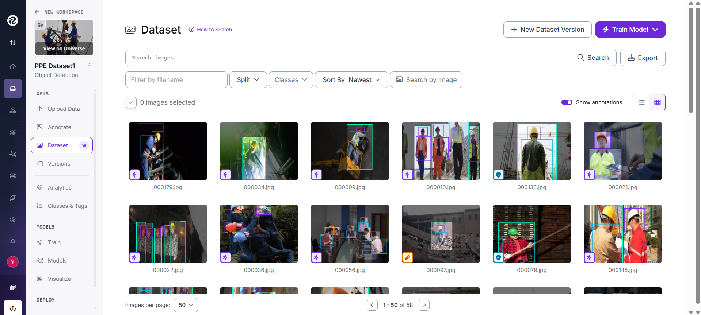
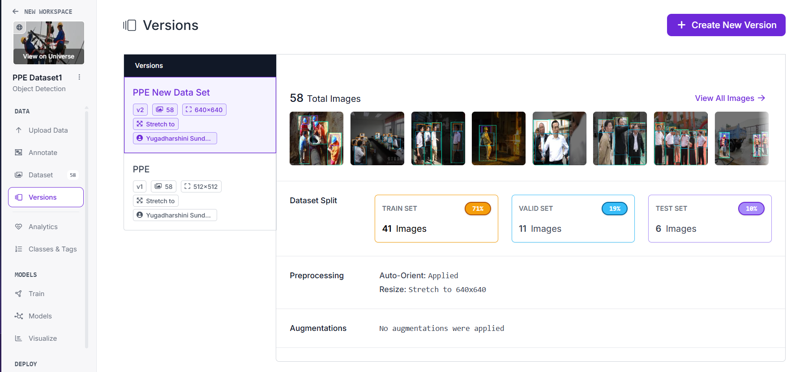
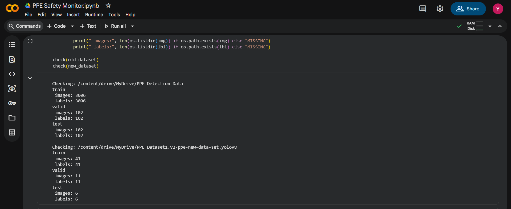
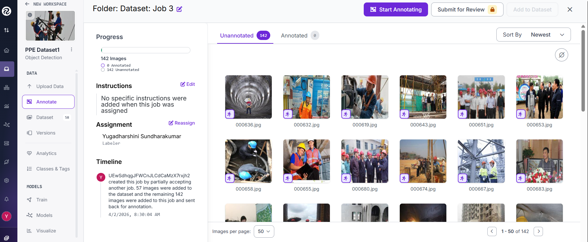
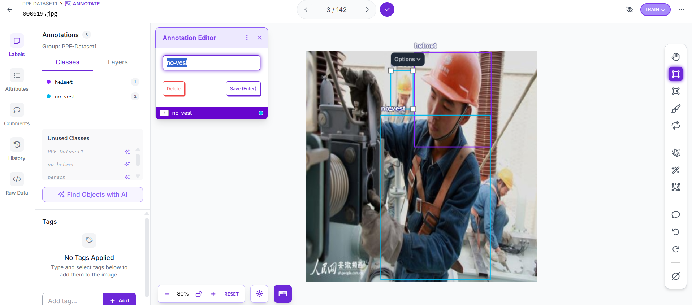
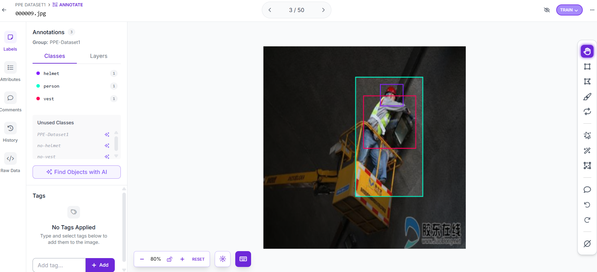
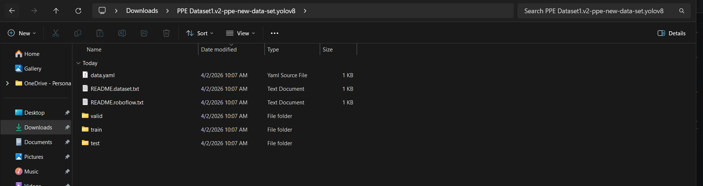

## 1. Data Sources

### 2.1 Public Dataset (Kaggle)

A publicly available PPE detection dataset was downloaded from Kaggle and used as the base dataset.

- Source: Kaggle PPE Detection Dataset  
- Purpose: Provides a large number of labeled images for detecting workers and PPE  

### 2.2 Custom Dataset (Google + Roboflow)
To satisfy the custom dataset requirement, additional images were collected manually from Google Images and annotated using Roboflow.

- Image source: Google Images  
- Annotation tool: Roboflow  
- Number of custom images: 57  
- Annotation type: Bounding box labeling  

The custom dataset uses the same class structure as the Kaggle dataset to ensure compatibility.

## 3. Data Collection Process
The dataset was built in two stages:

1. A PPE detection dataset was downloaded from Kaggle.
2. Additional images were collected from Google to include more real-world construction scenarios.

The custom images were selected to include:
- Different worker poses  
- Safe and unsafe PPE usage  
- Different environments and lighting conditions  

These images were then manually labeled using Roboflow.

---

## 4. Annotation Approach
All custom images were manually annotated using Roboflow.

### Annotation Details
- Tool used: Roboflow  
- Annotation method: Manual bounding boxes  
- Number of labeled images: 57  

Each object in the image was labeled according to predefined PPE classes. Care was taken to ensure that labels were consistent with the Kaggle dataset.

---

## 5. Classes
The dataset contains the following 5 classes:

1. helmet  
2. no-helmet  
3. no-vest  
4. person  
5. vest  

These classes are used to identify PPE compliance and detect safety violations.

---

## 6. Dataset Size and Split

### Kaggle Dataset
- Train images: 3006  
- Validation images: 102  
- Test images: 102  

### Custom Roboflow Dataset
- Train images: 41  
- Validation images: 11  
- Test images: 6  

### Final Combined Dataset
After merging both datasets:

- Train images: 3047  
- Validation images: 113  
- Test images: 108  
- Total images: 3268  

---

## 7. Dataset Merging Strategy
The Kaggle dataset and the custom Roboflow dataset were merged by combining their respective folders:

- train/images and train/labels  
- valid/images and valid/labels  
- test/images and test/labels  

Since both datasets used the same class labels and YOLO format, they were merged directly without requiring relabeling.

---

## 8. Purpose of Custom Data
The custom dataset was created to:

- Satisfy the assignment requirement for a custom dataset  
- Demonstrate manual data collection and annotation skills  
- Add new real-world examples beyond the Kaggle dataset  
- Improve dataset diversity  

---

## 9. Proof / Evidence
The following proof is provided to verify dataset preparation:

- Screenshot of Roboflow project  

- Screenshots of manually labeled images  

- Sample annotated images  

- Dataset folder structure and counts  

---

## 10. Limitations
Some limitations of the dataset include:

- The custom dataset is relatively small (57 images)  
- Images collected from Google may vary in quality  
- Some images contain occlusion or complex backgrounds  
- Class distribution may not be perfectly balanced  

Despite these limitations, the dataset is sufficient for training a PPE detection model and demonstrating the full pipeline.

---

## 11. Summary
This project uses a combined dataset created from:

- A public PPE dataset from Kaggle  
- 57 manually collected and annotated images using Roboflow  

This approach ensures both scalability (from Kaggle data) and originality (from custom data), fulfilling the requirements of the assignment.