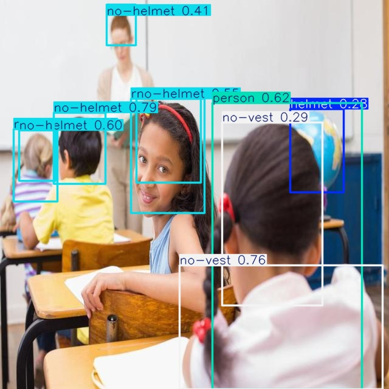
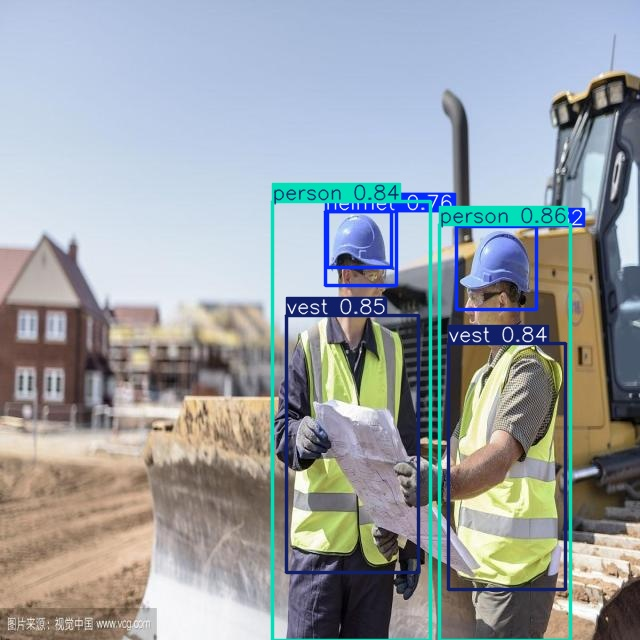

# 🚨 Safety Rules Definition

## 1. Overview
This system monitors construction site safety by detecting workers and evaluating whether they are wearing required Personal Protective Equipment (PPE).

The model identifies PPE-related objects and applies rule-based logic to classify each scene as:
- **Safe ✅**
- **Unsafe ❌**

---

## 2. Safety Rules

### 🔹 Rule 1: Helmet Compliance
**Definition:**  
Every worker on site must wear a safety helmet at all times.

**Safe Condition ✅:**
- A person is detected wearing a helmet (`helmet` class)

**Violation ❌:**
- A person is detected without a helmet (`no-helmet` class)
- A person is present but no helmet is detected

**Example Violations:**
- Worker standing on site without helmet  
- Worker holding helmet but not wearing it  

📷 Example:

---

### 🔹 Rule 2: Safety Vest Compliance
**Definition:**  
Every worker must wear a high-visibility safety vest.

**Safe Condition ✅:**
- A person is detected wearing a vest (`vest` class)

**Violation ❌:**
- A person is detected without a vest (`no-vest` class)
- A person is present but no vest is detected

**Example Violations:**
- Worker without reflective vest  
- Vest partially worn or not visible  

📷 Example:

---

### 🔹 Rule 3: Full PPE Compliance
**Definition:**  
Each worker must wear both:
- Helmet  
- Safety vest  

**Safe Condition ✅:**
- Both `helmet` and `vest` are detected along with `person`

**Violation ❌:**
- Missing helmet  
- Missing vest  
- Missing both  

📷 Example:

---

## 3. Safety Decision Logic

The system uses a rule-based layer after object detection.

### Logic:

- If `person` is detected AND:
  - `helmet` is present  
  - `vest` is present  
  - No violation classes (`no-helmet`, `no-vest`)  

→ **SAFE ✅**

---

- If any of the following is detected:
  - `no-helmet`  
  - `no-vest`  
  - Missing PPE  

→ **UNSAFE ❌**

---

- If no `person` is detected:
→ **No worker detected (not evaluated)**

---

## 🔍 Enhanced Inference Output

The system overlays a final safety decision directly on the image:

- SAFE (green)
- UNSAFE (red)

This improves interpretability and makes the system more practical for real-world monitoring.

## 4. Example Scenarios

### ✅ Safe Scenario
- Worker wearing helmet and vest  
- No violations detected  

📷 Example:

---

### ❌ Unsafe Scenario – Missing Helmet
- Worker without helmet  

📷 Example:

---

### ❌ Unsafe Scenario – Missing Vest
- Worker without vest  

📷 Example:

---

### ❌ Unsafe Scenario – Multiple Violations
- Worker missing both helmet and vest  

📷 Example:

---

## 5. Important Design Choice

This system performs **scene-level classification**:

> If any safety violation is detected in the image, the entire scene is marked as unsafe.

This simplifies decision-making and ensures that no violation is ignored.

---

## 6. Limitations of Safety Rules

- Does not match PPE per individual worker (scene-level only)  
- May misclassify in crowded scenes  
- Dependent on detection accuracy  
- Occlusion or poor lighting may affect detection  

---

## 7. Summary
The system enforces simple and interpretable safety rules based on PPE detection:

- Helmet required  
- Vest required  
- Missing PPE → Unsafe  

This rule-based approach ensures that model predictions are understandable and aligned with real-world safety requirements.